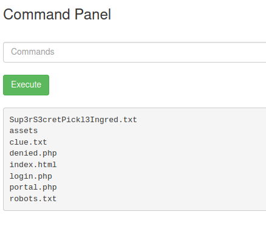

## Introduction

Link to TryHackMe Room: https://tryhackme.com/room/picklerick
By: tryhackme

* * *

## Reconnaissance

First step is to visit the website at https://10-10-101-205.p.thmlabs.com/ which shows us that Rick has turned himself into a Pickle, he needs Morty (Us) to log on to his computer but he forgot the password. Let's investigate the webpage and see what we can find.

Right away we should check the source page for the website. I am using Mozilla firefox.

And good thing we checked, we found a username.

  

  
Username: R1ckRul3s

We will keep poking around. There is an image on the main page, if we open it in a new tab it may show us a path of existing folders. And sure enough, there is a folder called **assets**

  

There is not much here apart from a few funny gif files and the information for the server. We now know it's an Apache server running on port 80.

Opening the source code of the page shows us the following.

  

So there is an **icons** directory ont he server as well. Which we do not have access to.

  

Let's switch gears a little and see if Nmap will find anything.

  

We have another port open, which is 22 SSH.
Looking on Exploit-db there aren't that many good exploits we can use here.

Let's run dirbuster instead to see what other hidden directories there might be.

  

Nice, we have a login page, a robots.txt file, and a server status page.

I think that's enough to go off of for now, time to begin exploiting.

## Exploitation

* * *

First, let's try some SQL injection on the login page.

Looks like it's not vulnerable to SQL injection, maybe should try out the other sites.

Going to the https://10-10-101-205.p.thmlabs.com/robots.txt showed us a single word, maybe this is a password?

Yes it is, how simple was that. We are now logged in.

It seems we have a place to enter commands, and a bunch of other pages that forbid us from looking at them.

Let's enter the **ls** command to see if anything pops up.

  

Lets open he file with **cat**

Can't do that...

  

Maybe we can open it in the browser?

  

That worked!

Let's poke around and see if we can find the second ingredient. Wonder what's in the User home directories.

Running **ls/home** shows an Ubuntu and Rick folder, and running the **ls /home/rick** command revealed the "second ingredient" file.

Using the above methods to open the file did not work, maybe we can try the **less** command.

`less "/home/rick/second ingredients"`

And it worked, we have our second ingredient.

Let us keep looking around in the other directories until we find something of interest.

After a couple minutes nothing came up, perhaps we need to look in secure folders with elevated permissions?

Let's see if we can look in the root folder with `sudo ls /root`.

And sure enough we can, the **3rd.txt** file seems interesting. Let's use the `less` command again.

`sudo less /root/3rd.txt`

And we have our 3rd ingredient!!
